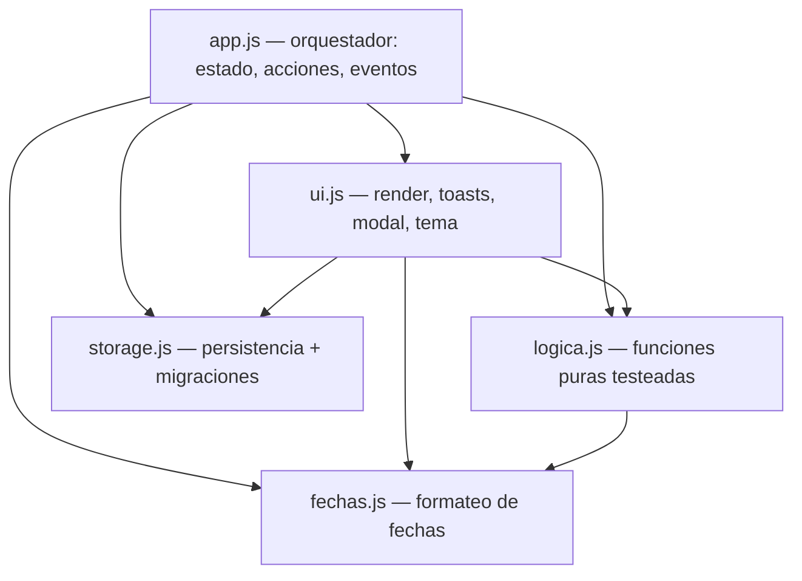

# Mis Tareas — Gestor de proyectos y tareas

Gestor personal en JavaScript vanilla (ES Modules, sin dependencias): proyectos con
color, prioridades, fechas de vencimiento, búsqueda, reordenamiento drag & drop y
persistencia local con migración de esquema.

**[▶ App en vivo](https://migueltapiaurrutia.github.io/gestor-tareas/)** ·
**[✓ Tests en vivo](https://migueltapiaurrutia.github.io/gestor-tareas/tests.html)** (36 tests públicos)

## La historia de este código

Este repo es un ejercicio deliberado de trabajo sobre código heredado. Cada hito
está respaldado por el `git log`:

1. **Nació como prototipo generado con IA** bajo una dirección de diseño propia (neo-brutalista) y se importó como legado: un `app.js` monolítico de 507 líneas en una IIFE.
2. **Tests de caracterización ANTES de tocar nada**: 20 tests que capturan el comportamiento real (filtros, órdenes, bordes de `isOverdue`) como red de seguridad.
3. **Refactor a módulos ES sin cambio de comportamiento**: el monolito se dividió en 5 módulos con los tests en verde y la app idéntica.
4. **Correcciones quirúrgicas, un commit cada una**: el bug latente del tema (asimetría escritura JSON / lectura cruda que podía matar la app con un `SyntaxError`), `crypto.randomUUID()` en vez de ids artesanales, `addEventListener('error')` en vez de `onerror` inline, jerarquía de encabezados.
5. **Extensión con la dimensión de proyectos**: migración de datos idempotente con `schemaVersion`, filtro por proyecto, reasignación al eliminar y drag & drop coherente por vista — 16 tests nuevos.

## Arquitectura



## Funcionalidades

- Proyectos con color (paleta con contraste verificado en ambos temas), contador de pendientes y «General» por defecto
- Tareas con prioridad, vencimiento (aviso de vencida) y edición inline
- Búsqueda, filtros por estado y ordenación: vencimiento, prioridad, recientes, A–Z o manual
- Reordenamiento drag & drop dentro de cada proyecto
- Tema claro/oscuro con respeto a la preferencia del sistema
- Perfil con avatar por URL e iniciales como respaldo
- Persistencia en `localStorage` con migración de esquema versionada

## Decisiones técnicas

- **Tests antes del refactor (caracterización)**: capturan el comportamiento actual, no el ideal; el refactor se hizo contra esa red
- **Migración idempotente con versionado de esquema**: correrla dos veces no daña; `schemaVersion` permite encadenar futuras migraciones
- **Eliminar proyecto reasigna a General en vez de borrar en cascada**: los datos del usuario primero — un error de reasignación se deshace, una cascada no
- **Drag & drop solo donde el orden es inequívoco**: proyecto específico + orden manual, sin filtros ni búsqueda; en «Todos» mezclaría órdenes de proyectos distintos
- **Conventional commits** (`feat/fix/refactor/test/docs`) desde el refactor

## Ejecutar y testear en local

```bash
python -m http.server   # los módulos ES no cargan con file://
# http://localhost:8000/index.html — app
# http://localhost:8000/tests.html — tests (también: node js/tests.js)
```

## Limitaciones conocidas

- El drag & drop no tiene soporte táctil ni alternativa de teclado (próxima iteración); las ordenaciones automáticas funcionan en cualquier dispositivo
- Los datos viven en `localStorage`: son por navegador y dispositivo, sin sincronización

---

**Estado: ✅ Completado**
